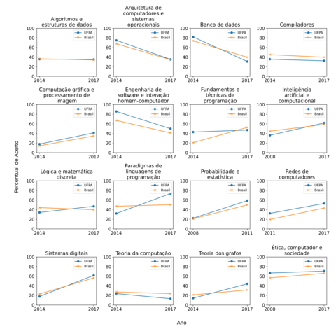
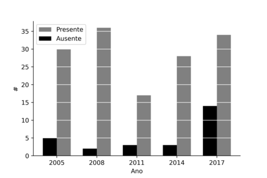

# KDD-Enade-Computing

[](https://travis-ci.com/renan-cunha/KDD-HigherEduBR) [](https://codecov.io/gh/renan-cunha/KDD-HigherEduBR)

Data Mining with the ENADE of Brazilian Computer Science courses

## About the Project

This is the code from the paper *[Automatic Analysis with ENADE Microdata to Improve 
the Quality of Computer Science Courses](https://sol.sbc.org.br/index.php/wei/article/view/15912Automatic)*

Enade is the exam applied at the end of the course in order to measure the performance of students.
This analysis uses ENADE microdata from the Brazilian Computer Science Courses.
The goal is to provide information that can be useful for directors and coordinators
who want to improve the quality of their courses. 

The data tells:

1. which are the deficient subjects of the course (e.g., computer networks, software engineering, etc);
2. what is the change in performance in a given subject over the years; 
3. if the students have low participation in the exam. 





### Built with

* [Python](https://www.python.org/) and its Data Science toolkit ([Numpy](https://numpy.org/), [Pandas](https://pandas.pydata.org/),
  [Matplotlib](https://matplotlib.org/), [Seaborn](https://seaborn.pydata.org/))
* [Jupyter Notebooks](https://jupyter.org/)
* [Papermill](https://papermill.readthedocs.io/)
* [Cookiecutter Data Science Project Structure](https://drivendata.github.io/cookiecutter-data-science/)

## Getting Started

### Prerequisities

* Linux/WSL
* Make
* [Conda](https://docs.conda.io/projects/conda/en/latest/user-guide/install/linux.html)
* A minimum of 8gb of ram, 16gb is recommended.

### Set up Environment

```
git clone git@github.com:renan-cunha/KDD-Enade-Computing.git
cd KDD-Enade-Computing/
make create_env
conda activate KddEnade
```

## Usage

First, download and pre-process data, 
then run the analysis with the desired course.

### Download and Process Data
```
make download_and_process
```

### Run the Analysis

To run the analysis, use the [e-mec code](https://emec.mec.gov.br/) of the computer science course you want. Below is an example with the course of the UFPA.

```
make code_course=12025 run_analysis
```

### View the Results

All the results are presented in four notebooks of the ```results/``` folder.

```
cd results/
jupyter-notebook <name-of-the-notebook>.ipynb
```

## Contributing

Feel free to fork the project, we do not have the intent to close issues or accept pull requests in the moment.

## License

This project is licensed under the MIT License - see the [LICENSE](https://github.com/renan-cunha/KDD-HigherEduBR/blob/master/LICENSE) file 
for details.

## Contact

Renan Cunha - [renancunhafonseca@gmail.com](renancunhafonseca@gmail.com)

## Acknowledgements

This repository was developed as a research project at the Universidade Federal do Pará, with the guidance of Professor [Reginaldo Santos](https://www.escavador.com/sobre/5457885/reginaldo-cordeiro-dos-santos-filho) and [Claudomiro Sales](https://www.linkedin.com/in/claudomiro-sales-7923b121/).

[](https://portal.ufpa.br/ "Visite o site da UFPA")
